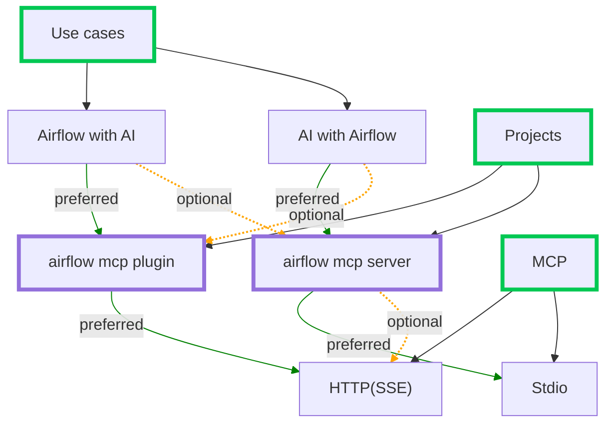

```mermaid
---
config:
  layout: fixed
  theme: mc
---
flowchart TD
    UseCases["Use cases"] --> AirflowWithAI["Airflow with AI"] & AIWithAirflow["AI with Airflow"]
    AirflowWithAI -- preferred --> AirflowMcpPlugin["airflow mcp plugin"]
    AIWithAirflow -- preferred --> AirflowMCPServer["airflow mcp server"]
    Projects["Projects"] --> AirflowMcpPlugin & AirflowMCPServer
    AirflowMcpPlugin -- preferred --> HTTP["HTTP(SSE)"]
    AirflowMCPServer -- preferred --> Stdio["Stdio"]
    MCP["MCP"] --> HTTP & Stdio
    AirflowWithAI -. optional .-> AirflowMCPServer
    AIWithAirflow -. optional .-> AirflowMcpPlugin
    AirflowMCPServer -. optional .-> HTTP
    style UseCases stroke:#00C853,stroke-width:4px,stroke-dasharray: 0
    style AirflowMcpPlugin stroke-width:4px,stroke-dasharray: 0
    style AirflowMCPServer stroke-width:4px,stroke-dasharray: 0
    style Projects stroke:#00C853,stroke-width:4px,stroke-dasharray: 0
    style MCP stroke:#00C853,stroke-width:4px,stroke-dasharray: 0
    linkStyle 2 stroke:green,fill:none
    linkStyle 3 stroke:green,fill:none
    linkStyle 6 stroke:green,fill:none
    linkStyle 7 stroke:green,fill:none
    linkStyle 10 stroke:orange,stroke-width:2px,fill:none
    linkStyle 11 stroke:orange,stroke-width:2px,fill:none
    linkStyle 12 stroke:orange,stroke-width:2px,fill:none
```